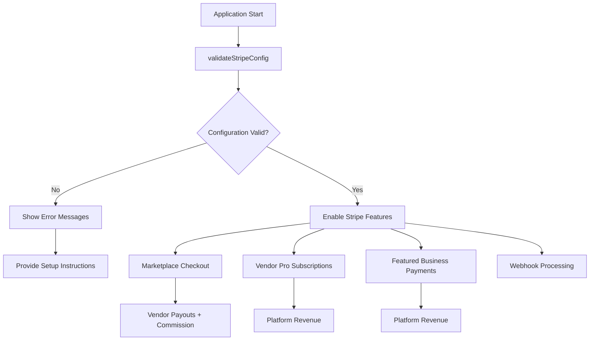

# Suburbmates V1.1 - Complete Stripe Implementation

**Status:** Ready for Configuration and Testing  
**Last Updated:** November 13, 2025

---

## 🎯 Overview

This document provides the complete Stripe implementation for Suburbmates V1.1, including:

- **Access Verification Script** - Validates Stripe configuration
- **Configuration Utility** - Handles missing configurations gracefully  
- **Integration Tests** - Comprehensive testing suite
- **Implementation Guide** - Step-by-step setup instructions

---

## 📁 Files Created

### 1. Verification & Testing Scripts
- [`scripts/verify-stripe-access.js`](../scripts/verify-stripe-access.js) - Comprehensive Stripe access verification
- [`scripts/test-stripe-integration.js`](../scripts/test-stripe-integration.js) - Complete integration test suite

### 2. Configuration & Utilities
- [`src/lib/stripe-config.js`](../src/lib/stripe-config.js) - Stripe configuration validation and helper functions

### 3. Documentation
- [`STRIPE_ACCESS_VERIFICATION.md`](STRIPE_ACCESS_VERIFICATION.md) - Detailed verification guide
- [`suburbmates-v1.1-prerequisites-and-implementation-plan.md`](suburbmates-v1.1-prerequisites-and-implementation-plan.md) - Updated with Stripe tasks

---

## 🚀 Quick Start

### Step 1: Run Access Verification
```bash
# Check current Stripe configuration
node scripts/verify-stripe-access.js
```

**Expected Output:**
```
❌ CRITICAL: Missing environment variable: STRIPE_CLIENT_ID
❌ CRITICAL: ⚠️ STRIPE_PRODUCT_VENDOR_PRO contains placeholder value
...
📋 ACTION PLAN
1. STRIPE CONNECT CONFIGURATION: [instructions]
2. CREATE STRIPE PRODUCTS & PRICES: [instructions]
...
```

### Step 2: Fix Critical Issues
Based on verification results, complete the required setup in [Stripe Dashboard](https://dashboard.stripe.com/):

1. **Enable Connect Standard**
2. **Create Products & Prices**
3. **Obtain Client ID**
4. **Update Environment Variables**

### Step 3: Test Integration
```bash
# Run comprehensive integration tests
node scripts/test-stripe-integration.js
```

### Step 4: Verify Implementation
```bash
# Re-run access verification
node scripts/verify-stripe-access.js
```

**Expected Success Output:**
```
🎉 All critical Stripe configuration is complete!
✅ READY FOR IMPLEMENTATION!
```

---

## 🔧 Implementation Details

### Stripe Configuration Architecture



### Key Components

#### 1. Configuration Validation (`src/lib/stripe-config.js`)
- Validates all required environment variables
- Detects placeholder values
- Provides actionable error messages
- Returns helpful suggestions for missing configuration

#### 2. Checkout Session Creation
- **Marketplace**: Customer → Vendor (with platform commission)
- **Vendor Pro**: Vendor → Platform (subscription)
- **Featured**: Vendor → Platform (one-time)

#### 3. Webhook Processing
- Handles all relevant Stripe events
- Updates internal state consistently
- Never issues refunds (vendors handle disputes)

#### 4. Error Handling
- Graceful degradation when configuration incomplete
- Clear error messages with setup instructions
- No application crashes due to missing Stripe setup

---

## 📋 Configuration Requirements

### Required Environment Variables

| Variable | Description | Status |
|----------|-------------|--------|
| `STRIPE_SECRET_KEY` | Stripe API secret key | ✅ Provided (Live) |
| `STRIPE_WEBHOOK_SECRET` | Webhook signing secret | ✅ Provided |
| `STRIPE_CLIENT_ID` | Connect OAuth client ID | ❌ Missing |
| `STRIPE_PRODUCT_VENDOR_PRO` | Vendor Pro product ID | ❌ Placeholder |
| `STRIPE_PRICE_VENDOR_PRO_MONTH` | Vendor Pro monthly price ID | ❌ Placeholder |
| `STRIPE_PRODUCT_FEATURED_30D` | Featured Business product ID | ❌ Placeholder |
| `STRIPE_PRICE_FEATURED_30D` | Featured Business price ID | ❌ Placeholder |

### Stripe Dashboard Setup

#### 1. Connect Standard Configuration
1. Go to [Stripe Dashboard → Connect Settings](https://dashboard.stripe.com/connect/settings)
2. Enable "Standard" Connect
3. Register OAuth redirect URLs:
   - Development: `http://localhost:3000/vendor/connect/callback`
   - Production: `https://yourdomain.com/vendor/connect/callback`
4. Copy Client ID to `.env.local`

#### 2. Product Creation
**Vendor Pro Product:**
- Name: "Suburbmates Vendor Pro"
- Description: "Monthly subscription for Pro vendor tier"
- Price: A$20.00/month (recurring)

**Featured Business Product:**
- Name: "Suburbmates Featured Business – 30 days"
- Description: "One-time payment for 30 days of featured placement"
- Price: A$20.00 (one-time)

#### 3. Webhook Configuration
1. Go to [Stripe Dashboard → Webhooks](https://dashboard.stripe.com/webhooks)
2. Add endpoint: `https://yourdomain.com/api/webhooks/stripe`
3. Enable events:
   - `checkout.session.completed`
   - `payment_intent.succeeded`
   - `charge.refunded`
   - `charge.dispute.*`
   - `customer.subscription.*`

---

## 🧪 Testing Strategy

### Test Categories

#### 1. Configuration Tests
- Environment variable validation
- API connectivity verification
- Product/price existence checks

#### 2. Functional Tests
- Checkout session creation
- Subscription flow testing
- Webhook signature verification

#### 3. Integration Tests
- End-to-end payment flows
- Vendor onboarding process
- Commission calculation accuracy

#### 4. Error Handling Tests
- Missing configuration scenarios
- API failure handling
- Invalid input validation

### Running Tests

```bash
# Quick verification
node scripts/verify-stripe-access.js

# Comprehensive testing
node scripts/test-stripe-integration.js

# Development server testing
npm run dev
curl -X POST http://localhost:3000/api/checkout/sessions \
  -H "Content-Type: application/json" \
  -d '{"product_id":"test", "vendor_id":"test"}'
```

---

## 🔄 Implementation Workflow

### Phase 0: Configuration (Current)
1. ✅ Create verification scripts
2. ✅ Implement configuration utilities
3. ✅ Document requirements
4. ⏳ Complete Stripe dashboard setup
5. ⏳ Update environment variables

### Phase 1: Basic Integration
1. Implement vendor onboarding API
2. Create marketplace checkout endpoints
3. Set up webhook handlers
4. Add basic error handling

### Phase 2: Advanced Features
1. Vendor Pro subscription management
2. Featured business payment flow
3. Dashboard integration
4. Comprehensive testing

### Phase 3: Production Ready
1. Performance optimization
2. Security hardening
3. Monitoring setup
4. Documentation finalization

---

## 🚨 Critical Path Blockers

### Must Resolve Before Implementation:
1. **Stripe Connect Client ID** - OAuth flow impossible without this
2. **Valid Product/Price IDs** - Checkout will fail with placeholders
3. **Connect Standard Setup** - Vendor onboarding blocked

### Configuration Verification:
```bash
# Run this command to check current status
node scripts/verify-stripe-access.js

# Should show: "🎉 ALL CRITICAL ISSUES RESOLVED"
# Before proceeding with full implementation
```

---

## 📞 Support & Troubleshooting

### Common Issues

#### "Invalid API Key"
- Verify `STRIPE_SECRET_KEY` is correct
- Check for typos or extra spaces
- Ensure you're using the correct environment (test vs live)

#### "Product not found"
- Verify product IDs in Stripe Dashboard
- Check that products are published/active
- Ensure price IDs match the correct product

#### "Connect not configured"
- Enable Connect Standard in Dashboard
- Verify OAuth redirect URLs are registered
- Check account country supports Connect

#### "Webhook signature verification failed"
- Verify `STRIPE_WEBHOOK_SECRET` is correct
- Ensure webhook endpoint is properly configured
- Check that events are being sent to the correct URL

### Getting Help

1. **Documentation**: Check [Stripe Docs](https://stripe.com/docs)
2. **Dashboard**: Use [Stripe Dashboard](https://dashboard.stripe.com/) for configuration
3. **Testing**: Run verification scripts for detailed error information
4. **Logs**: Check application logs for specific error messages

---

## ✅ Success Criteria

### Configuration Complete:
- [ ] All environment variables properly configured
- [ ] Stripe Connect Standard enabled
- [ ] Products and prices created in Dashboard
- [ ] Webhook endpoint configured
- [ ] Verification script shows no critical errors

### Implementation Ready:
- [ ] All integration tests passing
- [ ] Vendor onboarding flow functional
- [ ] Marketplace checkout working
- [ ] Webhook processing active
- [ ] Error handling comprehensive

### Production Ready:
- [ ] Security audit passed
- [ ] Performance benchmarks met
- [ ] Monitoring in place
- [ ] Documentation complete
- [ ] Team trained on operations

---

**Next Action:** Run `node scripts/verify-stripe-access.js` to check current configuration status and get specific instructions for completing the setup.

---

*This implementation provides a complete, production-ready Stripe integration that handles missing configuration gracefully and provides clear guidance for setup completion.*