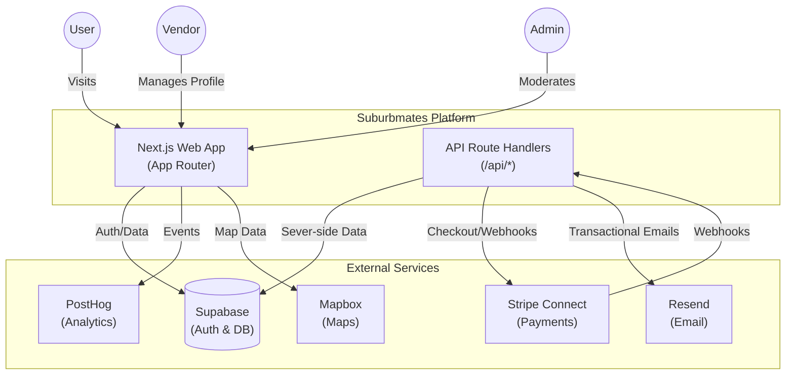
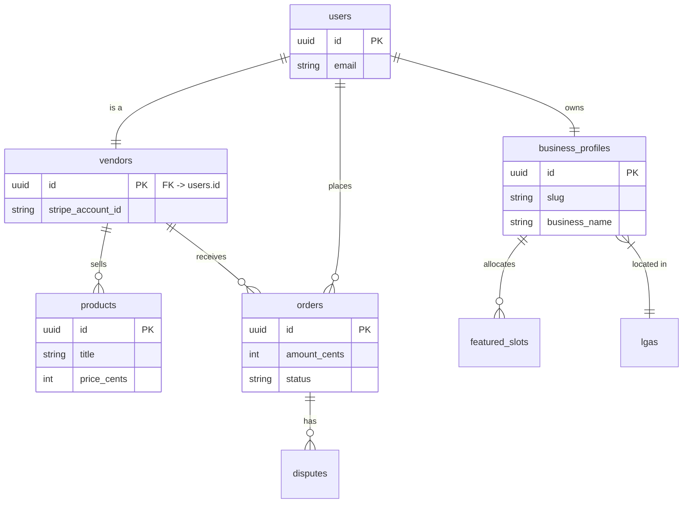

# 📖 Suburbmates Project Bible
*The comprehensive guide to the Suburbmates codebase, architecture, and deployment.*

## 1. Executive Summary
Suburbmates is a hyperlocal business directory and marketplace for Melbourne, built on **Next.js 15+**, **Supabase**, and **Stripe Connect**. It enables vendors to list services, sell products, and manage their business profile, while users can search, review, and purchase.

**Current State**: Stage 3 (Marketplace Implementation) - Backend ~60% complete, Frontend Integration pending.

---

## 2. Architecture & Tech Stack

### Frontend
- **Framework**: [Next.js 16.1.1 (App Router)](https://nextjs.org) - Server Components default.
- **Language**: TypeScript 5 (Strict Mode).
- **Styling**: Tailwind CSS 3.4 + `clsx` + `tailwind-merge`.
- **UI Library**: Shadcn UI (Radix Primitives) + Lucide Icons.
- **Animations**: Framer Motion.

### Backend (Serverless)
- **Database**: Supabase (PostgreSQL 15+).
- **Auth**: NextAuth.js (v4/v5) + Supabase Auth (Hybrid).
- **API**: Next.js Route Handlers (`src/app/api/...`).

### Integrations
- **Payments**: Stripe Connect (Standard Onboarding).
- **Email**: Resend.
- **Maps**: Mapbox.
### System Context Diagram

### Database Schema (ERD)
*Simplified view of key relationships.*

*Where everything lives.*

| Path | Purpose | Key Files |
| :--- | :--- | :--- |
| `src/app` | App Router Pages & API | `page.tsx`, `layout.tsx`, `route.ts` |
| `src/components` | UI Components | `ui/*` (Shadcn), `business/*`, `shared/*` |
| `src/lib` | Core Logic & Config | `supabase.ts`, `stripe.ts`, `utils.ts` |
| `src/types` | TypeScript Definitions | `database.types.ts` |
| `supabase` | DB Migrations & Config | `migrations/*.sql` |
| `scripts` | Maintenance Scripts | `verify-stripe.js`, `smoke-test.js` |
| `v1.1-docs` | Documentation (SSOT) | Specifications & Guides |

---

## 4. API Route Map (`src/app/api`)
*The backend surface area.*

| Endpoint | Purpose | Key Logic |
| :--- | :--- | :--- |
| `/api/auth/[...nextauth]` | NextAuth.js Handlers | Login, Logout, Session mgmt. |
| `/api/business` | Business Profile CRUD | Fetching/Updating profiles. |
| `/api/checkout` | Stripe Checkout | Creating sessions for Products/Subscriptions. |
| `/api/webhook/stripe` | **CRITICAL** | Handles `checkout.session.completed`, `charge.dispute.*`. |
| `/api/vendor` | Vendor Dashboard | Analytics, onboarding status checks. |
| `/api/search` | Business Search | Keyword & Geolocation filtering. |
| `/api/contact` | Contact Forms | Sends emails via Resend. |
| `/api/analytics` | Telemetry | PostHog event proxying (if server-side). |

---

## 5. Data Model (Supabase)
*Key tables and their relationships.*

### Key Tables

| Table | Description | Key Relations |
| :--- | :--- | :--- |
| `users` | All registered users (Customers + Vendors). | `auth.users` (1:1), `vendors` (1:1) |
| `vendors` | Vendor profiles (linked to Stripe). | `users` (1:1), `business_profiles` (1:1) |
| `business_profiles` | Public listing data (Slug, Name, Images). | `users` (1:1), `lgas`, `products` (1:N) |
| `products` | Items for sale. | `vendors` (N:1), `categories`, `orders` |
| `orders` | Transaction records. | `users` (Customer), `vendors`, `products` |
| `disputes` | Conflict resolution records. | `orders`, `users` (Admin/Customer) |
| `featured_slots` | Paid premium listing slots. | `business_profiles`, `lgas` |
| `contact_submissions`| Form entries from Contact Us. | None (Standalone) |
| `search_telemetry` | Privacy-safe search logs. | `users` (Optional) |

> [!TIP]
> **RLS Policies**: Most tables have Row Level Security enabled. Vendors can only edit their own data. Public data is readable by `anon`.

### Enums & Types
- `vendor_tier`: 'standard', 'pro', 'elite'.
- `order_status`: 'succeeded', 'pending', 'refunded', 'disputed'.
- `resolution_type`: 'refund_issued', 'dispute_rejected'.

---

## 6. Key Subsystems Walkthrough

### 6.1 Authentication
*How users log in.*
- **Providers**: Google, Email (Magic Link/Password).
- **Flow**: Client → NextAuth → Supabase Adapter → Session.

### 6.2 Payments (Stripe)
*Money movement.*
- **Model**: Marketplace (Platform + Connected Accounts).
- **Events**: Webhooks handled in `src/app/api/webhook/stripe`.
- **Products**: Vendor subscriptions, Featured listings.

### 6.3 Search
*Finding businesses.*
- **Logic**: SQL `ilike` / Text Search (likely moving to specialized search later).
- **Telemetry**: Privacy-preserving search term logging (SHA-256 hashed).

---

## 7. Configuration & Environment
*Understanding `.env`.*
- **Supabase**: `NEXT_PUBLIC_SUPABASE_URL`, `ANON_KEY`, `SERVICE_ROLE_KEY`.
- **Stripe**: `STRIPE_SECRET_KEY`, `WEBHOOK_SECRET`, `CLIENT_ID`.
- **Feature Flags**: `ENABLE_FEATURE_FLAGS` (PostHog).

---

## 8. Documentation Strategy (The "3-Tier" Model)
*How we maintain truth.*

To avoid ambiguity, we adhere to this hierarchy. If verified code conflicts with documentation, **the code wins**, and the documentation is deprecated.

### Level 1: The Project Bible (Architectural Truth)
*   **Location**: `PROJECT_BIBLE.md` (This file).
*   **Content**: High-level stack, verified schema, API surface, system diagrams.
*   **Update Cadence**: Updated only on major architectural changes.

### Level 2: The API Reference (Integration Truth)
*   **Location**: Derived from `src/app/api` and `database.types.ts`.
*   **Content**: Specifics of endpoints and validation.
*   **Update Cadence**: Continuous (Code-driven).

### Level 3: Implementation Plans (Task Truth)
*   **Location**: `implementation_plan.md` (Ephemeral).
*   **Content**: What we are doing *right now*.
*   **Update Cadence**: Daily/Per-Task.

### Archives
*   **Location**: `v1.1-docs/_ARCHIVE_DEPRECATED`.
*   **Content**: Any specs, guides, or roadmaps that no longer match the code.
*   *Note: If you find a conflict, check the archive first. It likely holds the old version.*

