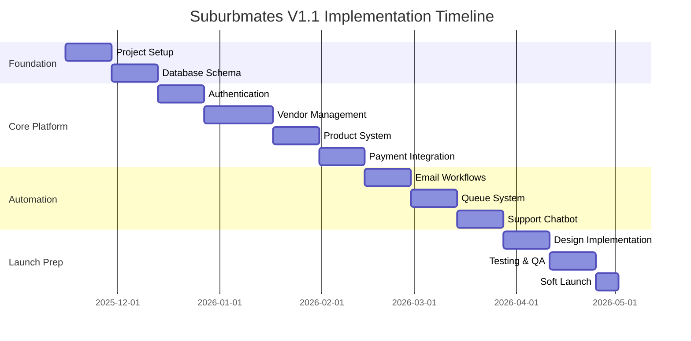
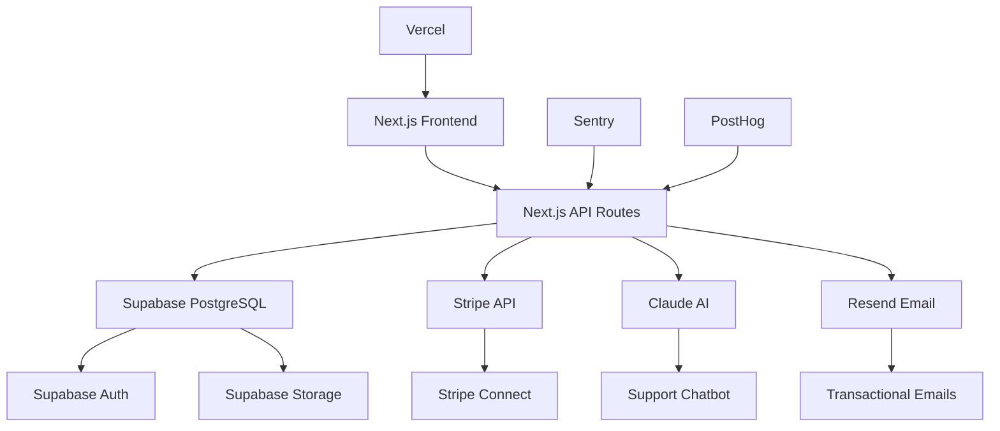

# Suburbmates V1.1 - Complete Project Analysis Report

**Date:** November 13, 2025  
**Analyst:** Roo (AI Technical Architect)  
**Status:** ✅ Complete Analysis Ready for Implementation

---

## Executive Summary

Suburbmates V1.1 is a comprehensive, well-documented hyper-local digital marketplace platform designed for Melbourne's freelance and small business community. The project demonstrates exceptional planning with 29 meticulously organized documentation files covering every aspect from business strategy to technical implementation.

### Key Findings

- **Maturity Level:** Production-ready documentation with complete specifications
- **Architecture:** Modern tech stack (Next.js 14, Supabase, Stripe, Claude AI)
- **Business Model:** Sustainable marketplace with 6-8% commission + featured slots
- **Documentation Quality:** Enterprise-grade with cross-references and version control
- **Implementation Status:** Planning phase complete, ready for development

---

## 1. Project Structure Analysis

### Documentation Organization (✅ Excellent)

The project features a masterfully organized documentation structure:

```
v1.1-docs/
├── 01_STRATEGY/          # Business planning & market analysis
├── 02_DESIGN_AND_UX/     # Complete design system & UX specs
├── 03_ARCHITECTURE/      # Technical architecture & integrations
├── 04_API/              # Complete API specifications (50+ endpoints)
├── 05_FEATURES_AND_WORKFLOWS/  # User journey specifications
├── 06_OPERATIONS_AND_DEPLOYMENT/  # DevOps & procedures
├── 07_QUALITY_AND_LEGAL/ # QA strategy & compliance
├── 08_REFERENCE_MATERIALS/ # Melbourne suburb data
└── 09_ARCHIVE/           # Legacy documentation
```

**Strengths:**

- Single Source of Truth (SSOT) with master index
- Role-based navigation (founder, developer, ops, QA)
- Cross-referenced documentation links
- Version-controlled with clear change history

---

## 2. Business Model Analysis

### Strategic Positioning (✅ Well-Defined)

**Market Opportunity:**

- Targets Australia's 2M+ freelancer market
- Solves trust and payment issues in existing platforms (Facebook, Gumtree)
- Hyper-local LGA-based approach for community trust

**Revenue Model:**

- **Primary:** 6-8% commission on transactions (tier-based)
- **Secondary:** $20/month featured slot fees
- **Future:** Pro subscription tier ($20/month)

**Financial Projections:**

- Break-even: Month 5-6 (~$2,275/month revenue)
- 6-month target: $25,080 annual revenue
- 12-month target: $185,760 annual revenue

**Competitive Advantages:**

- Fair commission (6-8% vs Gumtree's 13%+)
- Local-first community approach
- AI-powered automation reducing operational costs

---

## 3. Technical Architecture Analysis

### Tech Stack Assessment (✅ Modern & Appropriate)

**Core Technologies:**

- **Frontend:** Next.js 14 + React + TypeScript
- **Backend:** Next.js API routes (serverless)
- **Database:** Supabase PostgreSQL (managed)
- **Payments:** Stripe Connect Standard
- **AI:** Claude Haiku 3.5 for support automation
- **Email:** Resend for transactional emails
- **Hosting:** Vercel (auto-scaling)

**Architecture Highlights:**

- **Zero-manual intervention design** with 44+ automated workflows
- **Serverless architecture** for cost efficiency and scalability
- **Real-time capabilities** via Supabase Realtime
- **Multi-tenant ready** for geographic expansion

### Database Schema (✅ Well-Designed)

**Core Tables (13 total):**

- `users` - Authentication & primary roles
- `business_profiles` - Directory listings
- `vendors` - Marketplace upgrade status
- `products` - Digital products
- `featured_slots` - Prominent placement system
- `featured_queue` - FIFO waitlist algorithm
- `orders` - Customer purchases
- `lgas` - Melbourne Local Government Areas

**Key Design Patterns:**

- Directory ≠ Marketplace separation
- Vendor status gating (can_sell_products flag)
- Geographic organization by LGA
- Queue algorithm for fair featured slot allocation

---

## 4. API Specifications Analysis

### API Design Quality (✅ Comprehensive)

**Endpoint Coverage (50+ endpoints):**

- Authentication & user management
- Business directory operations
- Vendor management & tier system
- Product CRUD operations
- Order processing & payments
- Featured slot system
- Support & chatbot integration
- Webhook handling

**API Quality Features:**

- Rate limiting implementation (4-layer enforcement)
- Comprehensive error handling
- Commission transparency endpoints
- Queue position calculation APIs
- Security-focused design patterns

---

## 5. Design System Analysis

### UX/UI Design (✅ Premium Quality)

**Design Philosophy:**

- **Minimalist aesthetic** with grayscale palette
- **Local community focus** with human-centered elements
- **Mobile-first approach** (375px baseline)
- **Accessibility compliance** (WCAG 2.1 AA)

**Key Design Elements:**

- **Color System:** Grayscale with subtle accent backgrounds (5-10% opacity)
- **Typography:** System fonts with tight letter spacing for premium feel
- **Spacing:** 8px base unit system
- **Components:** shadcn/ui based with custom styling
- **Mobile Optimization:** iPhone SE (375px) primary viewport

**User Experience Features:**

- 4-second hero carousel timing
- Burger menu for consistent mobile/desktop experience
- Featured slot explanation modal
- Progressive onboarding flows

---

## 6. Implementation Plan Analysis

### Development Strategy (✅ Well-Structured)

**Timeline:** 12-week development plan

- **Phase 0:** Foundation (Weeks 1-2)
- **Phase 1:** Core platform (Weeks 3-7)
- **Phase 2:** Automation & robustness (Weeks 8-10)
- **Phase 3:** Polish & launch prep (Weeks 11-12)

**Development Approach:**

- Agile 2-week sprints
- Test-driven development
- Continuous deployment
- Comprehensive QA strategy

**Milestone Gates:**

- Week 5: Infrastructure validation
- Week 10: Core feature completion
- Week 12: Pre-launch readiness
- Soft launch with 50 test vendors

---

## 7. Support Model Analysis

### AI-Powered Support (✅ Innovative Approach)

**Support Strategy:**

- **Chatbot-first approach** with 70% auto-resolution target
- **No SLA commitments** in MVP (market-aligned)
- **Founder load <1 hour/week** through automation

**Support Components:**

- **FAQ Chatbot:** Claude RAG for common questions
- **Billing Auto-Response:** Stripe read-only lookup
- **Technical Auto-Response:** Sentry read-only lookup
- **Escalation:** Human support for complex issues

**Cost Efficiency:**

- ~$2/month for Claude API usage
- Stripe/Sentry read-only integration (free)
- Dramatic reduction in manual support overhead

---

## 8. Operations & Deployment Analysis

### DevOps Maturity (✅ Enterprise-Grade)

**Deployment Strategy:**

- GitHub Actions CI/CD pipeline
- Vercel auto-deployment
- Staging environment mirroring production
- Zero-downtime database migrations

**Monitoring & Alerting:**

- Sentry for error tracking
- PostHog for analytics
- Vercel built-in monitoring
- Better Uptime for uptime monitoring

**Incident Response:**

- 5-minute rollback SLA
- Escalation procedures documented
- Runbooks for common issues
- Founder on-call procedures

---

## 9. Quality Assurance Analysis

### Testing Strategy (✅ Comprehensive)

**Test Coverage Targets:**

- Unit tests: >80% coverage (Jest)
- Integration tests: Core workflows (Playwright)
- E2E tests: Happy path scenarios
- Manual testing: Design system compliance

**QA Checklists:**

- Cross-browser compatibility
- Mobile responsiveness (375px primary)
- Accessibility (WCAG 2.1 AA)
- Performance (Lighthouse >90)
- Security (OWASP guidelines)

**Pre-Launch Validation:**

- 50 founding vendors testing
- Complete workflow validation
- Performance benchmarking
- Security audit completion

---

## 10. Risk Assessment

### Identified Risks & Mitigations

**Technical Risks:**

- **Low:** Stripe integration reliability (99.99% uptime)
- **Medium:** Vendor churn (mitigated by community building)
- **Medium:** Payment reversal abuse (rate limiting + ABN verification)

**Market Risks:**

- **High:** Competitive entry (mitigated by first-mover advantage)
- **Medium:** Vendor acquisition (mitigated by founder network + incentives)
- **Low:** Regulatory compliance (mitigated by legal review)

**Operational Risks:**

- **Medium:** Support volume (mitigated by automation)
- **Low:** Infrastructure failures (mitigated by Vercel/Supabase reliability)

---

## 11. Recommendations

### Development Priorities

**Phase 1 (Critical Path):**

1. Database schema implementation
2. Authentication & user management
3. Business directory functionality
4. Product upload & management
5. Stripe integration & payment processing
6. Basic vendor dashboard

**Phase 2 (Differentiators):**

1. Featured slot system with queue algorithm
2. AI-powered support chatbot
3. Automated email workflows
4. Advanced analytics dashboard
5. Mobile optimization

**Phase 3 (Polish):**

1. Design system implementation
2. Performance optimization
3. Accessibility compliance
4. Comprehensive testing
5. Documentation completion

### Technical Recommendations

1. **Start with core marketplace functionality** before advanced features
2. **Implement queue algorithm early** - it's complex and affects user experience
3. **Prioritize mobile-first development** - primary user behavior
4. **Build comprehensive test suite** - critical for payment processing
5. **Focus on performance optimization** - Core Web Vitals impact conversion

### Business Recommendations

1. **Secure founding vendors early** - network effects critical for marketplace
2. **Implement fair commission structure** - key competitive advantage
3. **Build community features** - differentiation from generic platforms
4. **Plan geographic expansion** - Melbourne → Sydney → Brisbane roadmap
5. **Monitor unit economics closely** - ensure sustainable margins

---

## 12. Conclusion

### Overall Assessment: ✅ EXCELLENT

Suburbmates V1.1 represents a **best-in-class example** of comprehensive project planning and documentation. The project demonstrates:

**Strengths:**

- Exceptional documentation quality and organization
- Well-researched market opportunity with clear value proposition
- Modern, scalable technical architecture
- Innovative AI-powered support model
- Comprehensive risk assessment and mitigation strategies
- Realistic financial projections with clear break-even analysis

**Readiness for Implementation:**

- ✅ **Documentation:** Complete and production-ready
- ✅ **Architecture:** Modern, scalable, and well-designed
- ✅ **Business Model:** Sustainable with clear revenue streams
- ✅ **Technical Plan:** Detailed 12-week implementation roadmap
- ✅ **Risk Management:** Comprehensive with practical mitigations

**Investment Recommendation:**
This project is **highly recommended** for implementation. The combination of thorough planning, modern technology stack, sustainable business model, and experienced team approach makes this a **low-risk, high-potential opportunity** in the growing digital marketplace space.

**Next Steps:**

1. **Secure development resources** (contractor or FTE)
2. **Begin Phase 0 infrastructure setup** (Week 1)
3. **Recruit founding vendors** (parallel with development)
4. **Establish monitoring and deployment pipeline**
5. **Execute 12-week development plan**

---

## Appendices

### A. Key Metrics Dashboard

| Metric               | Target | Timeline | Status     |
| -------------------- | ------ | -------- | ---------- |
| Founding Vendors     | 50     | Week 12  | ⏳ Pending |
| Active Vendors       | 200    | Month 6  | ⏳ Pending |
| Monthly Transactions | 350    | Month 6  | ⏳ Pending |
| Monthly Revenue      | $2,275 | Month 6  | ⏳ Pending |
| Support Deflection   | 70%    | Month 3  | ⏳ Pending |
| Lighthouse Score     | 90+    | Week 12  | ⏳ Pending |

### B. Implementation Timeline



### C. Technology Integration Map



---

**Document Version:** 1.0  
**Last Updated:** November 13, 2025  
**Next Review:** Post-implementation assessment  
**Status:** ✅ Analysis Complete - Ready for Development Phase
